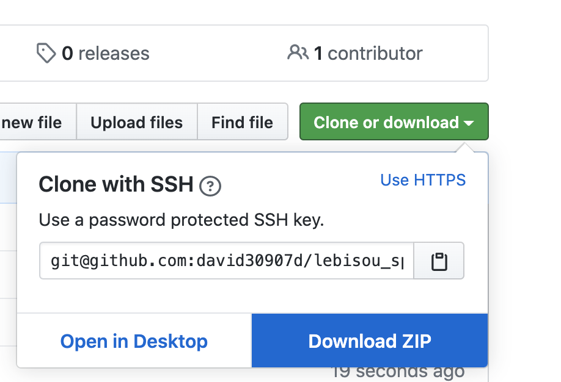

# DEMO

<https://drive.google.com/file/d/19SdBfXJuTcF2R5J2nk1bxsCKpTm2KBVB/view?usp=sharing>

# 如何使用

1. 先下載專案：

    
2. 下載 python3.7 並且安裝: [url](https://www.python.org/downloads/release/python-377/)
3. 初次執行時，要在本專案的目錄底下開啟 cmd，然後執行 `pip3 install -r requirements.txt`
4. 之後執行，只要在本專案的目錄底下開啟 cmd，然後執行 `python3 crawler.py` 即可。